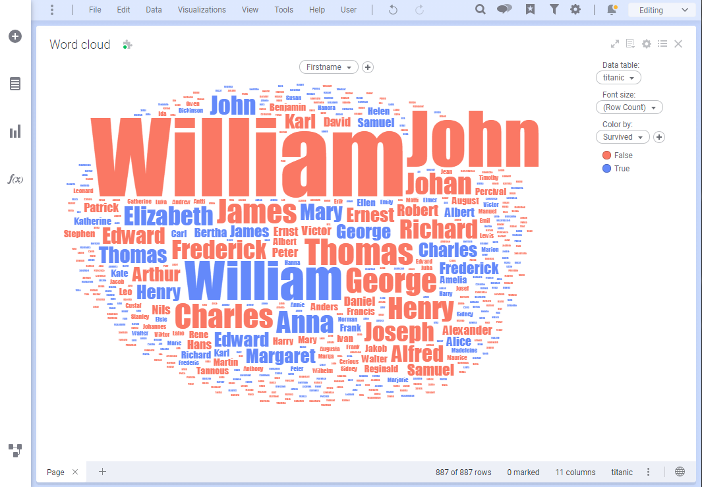

# Wordcloud MOD for TIBCO Spotfire®
Wordcloud let visualize textual information in a more visual and compelling manner than ever before. All the functionalities you expect are there: custom colors and font sizes, high performance, accurate and highly responsive markings, ... On top of that you can choose different word angles and layouts and specify font sizes yourself or let the Mod normalize these for you. 

## Try this mod in TIBCO Spotfire® Analyst
How to open the mod

1. Open Spotfire® Analyst, and create and analysis by loading some data.
2. Unzip the downloaded file, and locate the .mod file in the unzipped folder.
3. Drag the file into the analysis.
4. The visualization mod is added to the analysis.
5. To learn more about the capabilities and limitations of this visualization mod, keep reading or see the User Guide which is also located in the downloaded folder.

For general information on how to use and share visualization mods, you can read the Spotfire documentation.

## Getting started
To make the Wordcloud work properly you only need one column: Words. Keep those short for the best results. Having not too many different words also helps in keeping the visualization easily scannable.

To spice up things a bit more add a numerical column to indicate the relative font size of each word (absolute if you want, turn off the 'normalize font size' setting behind the upper right cogwheel), add a splash of color using the color axis or show words at different angles by changing the rotation setting behind the cogwheel.

# Development
## Prerequisites
These instructions assume that you have [Node.js](https://nodejs.org/en/) (which includes npm) installed.

## How to get started (with development server)
- Open a terminal at the location of this example.
- Run `npm install`. This will install necessary tools. Run this command only the first time you are building the mod and skip this step for any subsequent builds.
- Run `npm start`. This will bundle the JavaScript and place it in the `dist` folder. This task will watch for changes in the code and will continue running until it is stopped. Whenever you save a file, the changes will be reflected in the visualization mod.
- Run `npm run server` in a separate terminal. This will start a development server.
- Start editing, for example `src/index.js`.
- In Spotfire, follow the steps of creating a new mod and connecting to the development server.

## Working without a development server
- Open a terminal at the location of this example.
- Run `npm install`. This will install necessary tools. Run this command only the first time you are building the mod and skip this step for any subsequent builds.
- Run `npm run build`. This will bundle the JavaScript and place it in the `dist` folder. It also copies the contents of `static` into `dist`. This task will not watch for changes in the code.
- In Spotfire, follow the steps of creating a new mod and then browse for, and point to, the _manifest_ in the `dist` folder.
  